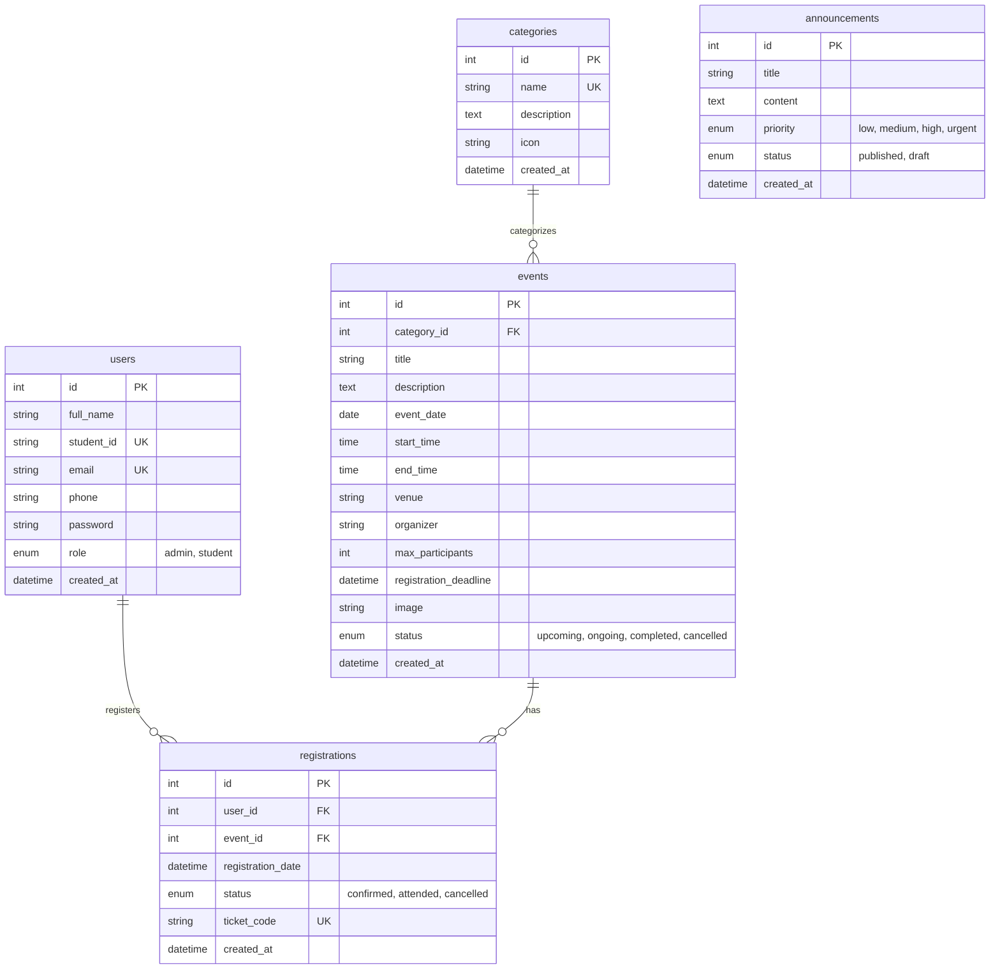

# 🎓 NSBM Event Hub — Full-Stack University Final Project

> **Centralized University Event Management, Digital Ticketing, and Analytics Platform**  
> Built strictly using **HTML5, CSS3, Vanilla JavaScript, PHP 8+, and MySQL** for **NSBM Green University**.

---

## 🌟 1. Project Overview

**NSBM Event Hub** is a university-wide web platform engineered to eliminate fragmented noticeboards, manual sign-ups, and unorganized social media posts by providing an Apple-inspired, centralized digital ecosystem for:
- Discovering upcoming university events, hackathons, sports tournaments, career fairs, and academic symposia across all 5 faculties.
- Real-time seat capacity tracking with animated occupancy progress bars.
- Live countdown timers for imminent campus events.
- Instant digital event pass generation with dynamic 2D QR codes for student check-in.
- Personal event timetable and schedule tracking.
- Role-based Administrative Command Center featuring real-time MySQL analytics charts (Chart.js), full CRUD event/category/announcement management, and one-click participant roster CSV export.

---

## 🛠️ 2. Technology Stack

This application is built with **100% native web technologies** and adheres strictly to core university examination requirements:

| Tier | Technologies Used | Notes |
| :--- | :--- | :--- |
| **Frontend** | HTML5, CSS3, Vanilla JavaScript | Semantic markup, Glassmorphism, CSS Custom Properties, Dark/Light theme engine, pure JS QR code generator |
| **Backend** | PHP 8+ | Native PDO with prepared statements, session management, input validation, role authorization guards |
| **Database** | MySQL (InnoDB) | Full relational schema, foreign keys, unique constraints, transactional integrity |
| **Styling** | Vanilla CSS3 (Custom Design System) | Apple-inspired aesthetics, micro-interactions, responsive flex/grid layouts, Bootstrap Icons |
| **Environment** | XAMPP / Apache / phpMyAdmin | Drop-in ready for `htdocs/nsbm-event-hub` or native PHP built-in server |

> 🚫 **Zero External Heavy Frameworks**: No React, No Vue, No Angular, No Node.js backend, No MongoDB, No Firebase, No Laravel, No Django. Genuine readable full-stack code.

---

## 🔑 3. Demo Credentials for Examination & Testing

The system comes pre-seeded with test accounts:

### 👑 Administrator Account
- **Email:** `admin@nsbmeventhub.com`
- **Password:** `Admin@123`
- **Portal URL:** `http://localhost/nsbm-event-hub/admin/login.html` (or `http://localhost:8080/admin/login.html`)
- *Feature:* Includes a **1-Click "Admin Demo" button** on the login page for instant testing.

### 🎓 Student Account
- **Email:** `student@nsbmeventhub.com`
- **Password:** `Student@123`
- **Portal URL:** `http://localhost/nsbm-event-hub/login.html` (or `http://localhost:8080/login.html`)
- *Feature:* Includes a **1-Click "Student Demo" button** on the login page.

---

## 📂 4. Project Directory Structure

```text
nsbm-event-hub/
│
├── index.html                    # Public Landing Page (Glass navbar, hero glow, stats, featured events, countdown)
├── events.html                   # Event Discovery Directory (Multi-filter, real-time keyword search)
├── event-details.html            # Event Details Page (Hero banner, schedule, capacity bar, QR ticket pass modal)
├── categories.html               # Categories Page (Category grid with dynamic event counts)
├── announcements.html            # University Notices & Alerts (Priority badges, keyword search)
├── about.html                    # About NSBM Green University Town & Faculties
├── login.html                    # Unified Student & Admin Login (with 1-Click Demo Fillers)
├── register.html                 # Student Registration (Real-time form validation)
│
├── student/
│   ├── dashboard.html            # Student Portal (Summary metrics, upcoming registered events, notices feed)
│   ├── my-events.html            # Registered Events List (Active/Attended/Cancelled tabs, cancel registration)
│   ├── schedule.html             # Personal Event Calendar & Timeline Timetable
│   └── profile.html              # Student Profile Management & Password Change
│
├── admin/
│   ├── login.html                # Dedicated Admin Portal Login
│   ├── dashboard.html            # Admin Command Center (Live MySQL statistics, Chart.js trends, recent logs)
│   ├── events.html               # Event Management (Data table, search, category filter, edit/delete actions)
│   ├── add-event.html            # Create Event Form (Date/time pickers, capacity limit, deadline)
│   ├── edit-event.html           # Edit Event Form (Pre-populated from MySQL)
│   ├── categories.html           # Category Management (CRUD with live event count badges)
│   ├── registrations.html        # Master Registrations Log (Search by ticket/student, inline status updater)
│   ├── announcements.html        # Announcement Management (CRUD with priority tags)
│   └── participants.html         # Participant Roster & Attendance Manager (CSV Export)
│
├── css/
│   ├── style.css                 # Master Design System (Glassmorphism, dark/light theme tokens, buttons, forms, tables)
│   ├── responsive.css            # Responsive Breakpoints (Mobile drawer nav, responsive data tables)
│   └── animations.css            # Micro-interactions, glow animations, card lifts, skeleton shimmer
│
├── js/
│   ├── main.js                   # Theme switcher, toast engine, modal controls, navbar state, countdown timer
│   ├── auth.js                   # Client Auth logic, login/register handlers, role route guards, demo fillers
│   ├── events.js                 # Event fetching, multi-filtering, capacity progress calculation, card rendering
│   ├── registration.js           # Event registration submission, dynamic QR code ticket modal, cancel registration
│   ├── admin.js                  # Admin Dashboard, Chart.js visualizations, participant roster & CSV export
│   ├── validation.js             # Form validation library with real-time feedback
│   └── qrcode.min.js             # Standalone client-side 2D QR Code generator
│
├── php/
│   ├── config/
│   │   └── database.php          # PDO connection, auto-setup fallback, JSON response & session helpers
│   ├── auth/
│   │   ├── login.php             # Login authentication (password_verify + session creation)
│   │   ├── register.php          # Student registration (password_hash + uniqueness checks)
│   │   ├── check_session.php     # Session verification & user profile data endpoint
│   │   └── logout.php            # Session termination
│   ├── events/
│   │   ├── create.php            # Admin create event
│   │   ├── read.php              # Read events (search, multi-filter, capacity compute, single event ID)
│   │   ├── update.php            # Admin update event
│   │   └── delete.php            # Admin delete event
│   ├── categories/
│   │   ├── create.php            # Admin create category
│   │   ├── read.php              # Fetch categories with aggregated event counts
│   │   ├── update.php            # Admin update category
│   │   └── delete.php            # Admin delete category
│   ├── registrations/
│   │   ├── register.php          # Student event registration (capacity, deadline, duplicate checks)
│   │   ├── read.php              # Read student personal passes or admin attendee rosters
│   │   ├── cancel.php            # Student cancel registration
│   │   └── update_status.php     # Admin update attendee status (Confirmed, Attended, Cancelled)
│   ├── announcements/
│   │   ├── create.php            # Admin create announcement
│   │   ├── read.php              # Read published notices
│   │   ├── update.php            # Admin update announcement
│   │   └── delete.php            # Admin delete announcement
│   ├── analytics/
│   │   └── dashboard_stats.php   # MySQL aggregation metrics for Admin Dashboard
│   └── profile/
│       └── update.php            # Update profile info and change password
│
├── database/
│   └── nsbm_event_hub.sql        # Full MySQL Schema, Foreign Keys, Constraints & Seed Data
│
└── README.md
```

---

## 🗄️ 5. Relational Database Architecture

The system uses a MySQL relational database named `nsbm_event_hub` with 5 normalized tables:



---

## 🚀 6. Installation & Setup Guide (XAMPP)

### Step 1: Place the Project in XAMPP
Copy the `nsbm-event-hub` project folder into your XAMPP `htdocs` directory:
```text
C:\xampp\htdocs\nsbm-event-hub
```

### Step 2: Start Apache and MySQL
1. Open the **XAMPP Control Panel**.
2. Click **Start** next to **Apache**.
3. Click **Start** next to **MySQL**.

### Step 3: Import Database via phpMyAdmin
1. Open your browser and navigate to: `http://localhost/phpmyadmin`
2. Click on the **Import** tab in the top navigation bar.
3. Click **Choose File** and select:
   ```text
   C:\xampp\htdocs\nsbm-event-hub\database\nsbm_event_hub.sql
   ```
4. Click **Import** at the bottom of the page.
*(Note: If you run the project without importing first, the built-in self-healing `php/config/database.php` will automatically create the database and tables for you!)*

### Step 4: Run the Application
Open your web browser and navigate to:
```text
http://localhost/nsbm-event-hub/
```

*(Alternatively, if running via PHP CLI: run `php -S 127.0.0.1:8080` in the project root and browse to `http://localhost:8080`)*

---

## 🔒 7. Security & Engineering Standards

1. **Password Security**: Passwords are never stored in plain-text. They use PHP standard `password_hash($pass, PASSWORD_BCRYPT)` and are verified via `password_verify()`.
2. **SQL Injection Protection**: 100% of database queries use PDO prepared statements with bound parameters (`$stmt->prepare()` and `$stmt->execute([...])`). No string interpolation in SQL queries.
3. **Cross-Site Scripting (XSS) Prevention**: All client-rendered and server-returned data is escaped using `htmlspecialchars()` and client `escapeHTML()` sanitizers.
4. **Session Security & RBAC**: HTTP-only, SameSite cookies with server-side session authentication. Unauthorized requests to Admin APIs (`create.php`, `delete.php`, etc.) return strict `401 Unauthorized` or `403 Forbidden` responses.
5. **Transactional Integrity**: Event registration uses MySQL transactions (`$pdo->beginTransaction()` and `FOR UPDATE` row locking) to prevent race conditions when events are near full capacity.

---

## 📊 8. Examination Demonstration Checklist

| Feature | Demonstration Flow |
| :--- | :--- |
| **1. Public Discovery** | Open `index.html` → View live countdown to nearest event → Browse `events.html` → Filter by "Technology & AI" or type keyword in real-time search. |
| **2. Student Registration** | Open `register.html` → Fill in details with real-time password strength validation → Submit → Auto-logged into Student Dashboard. |
| **3. Claim Event Pass** | Open `event-details.html?id=1` → Click "Register for this Event" → Watch capacity progress bar update → Instant Digital Ticket Pass modal opens with generated dynamic QR code! |
| **4. Personal Schedule** | Go to Student Portal → Click "My Events" (shows ticket pass, cancellation button) → Click "My Schedule" (shows chronological timeline). |
| **5. Admin Analytics** | Login at `admin/login.html` (Use 1-Click Demo) → View live MySQL metrics cards & Chart.js charts. |
| **6. Event CRUD** | Go to "Add Event" → Create an event → See it appear immediately on public pages → Edit event → Delete event. |
| **7. Category & Notice CRUD**| Add a new category in `admin/categories.html` → Post an Urgent Announcement in `admin/announcements.html`. |
| **8. Participant Export** | Open `admin/participants.html` → Select an event → View attendee table → Click "Export Roster to CSV" → Instant `.csv` spreadsheet downloaded. |
| **9. Theme Switcher** | Click the Sun/Moon icon in the top navbar to toggle between Apple-inspired Dark and Light modes. |

---

## 👨‍🎓 Project Credits
AR. Akmal Ahamath 
*Full-Stack University Final-Year Project 2026*
